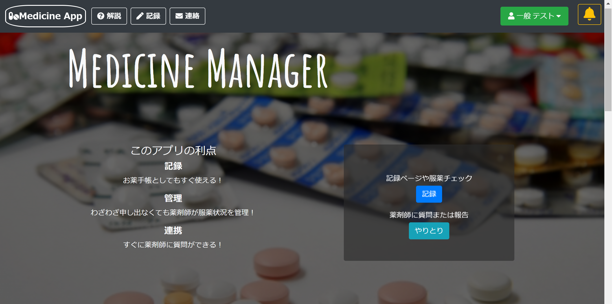

# Medicine Manager
 お薬の管理アプリです。
 
# DEMO
 
 https://medicine-manager-app.herokuapp.com/
 
 
# 特徴
 従来ある電子のお薬手帳としてだけでなく、患者様と薬剤師とのコミュニケーションを可能とするツールとして開発

 
# 使用技術
<h4>・言語: Ruby 	
・フレームワーク: Ruby on Rails 
・DB: MySQL 
・テスト: Rspec 
・開発環境構築: Docker 
	※ブランチを変更して導入しております。「DockerIntro」のブランチにてDockerfile、docker-compose.ymlをご参照ください。 
・本番環境: heroku 
・バージョン管理: Git/GitHub 
	※ブランチを変えることでチーム制作を意識しております。 </h4>

<その他の技術> 
・gemによる各種機能: deviseによるログイン機能、kaminariによるページネーション、 
		　　              ransackによるDB検索機能、simple_calendarによるカレンダー表記 
・Bootstrap、SCSSを用いたスタイリング 
・jQuery、Javascriptを利用したAjax実装、動的エフェクト実装 
・API連携を利用したログイン等の機能実装

# 機能一覧
 ・電子お薬手帳
   自分で記録することもできますが、薬局で実装していれば薬局で記録してもらうこともできます。
   
 ・服薬チェッカー
 　飲んだ日にボタンを押すだけ！残りいくつの薬が余っているかまで瞬時にわかります。
  
 ・薬剤師とのやり取り
   実装している薬局の薬剤師とやりとりを行うことができます。直接話せないことも気軽に質問ができます。

# 開発に意識したこと
  医療の貢献となるようにとにかく手軽さと使いやすさを意識しました。
　PCだけでなく、スマートフォンを利用することを想定してレスポンシブなデザインにしております。
  使い方もシンプルな上に、自然なエフェクトもつけることで、直感的に使用できるように作成いたしました。
  日本で最も使われているLineと連携しており登録の手軽さもあります。 
 
# 今後の展開
  外部DBとの連携による医薬品情報の入力簡便化、正確性の向上
  
